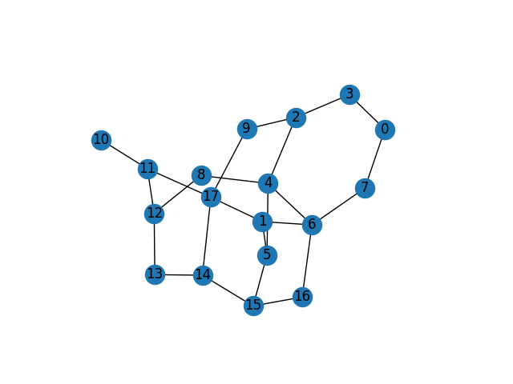

# SOF_Data_Sets (Created by Huy Duong in the Ciena SOF-WP1 Project)

Next features:
- VNF placement procedure
- Data sets for larger network 

Current network and traffic data sets are generated with the idea that resources are always available to SFC requests

Code to read raw network topology and to generate data can be found in file "Src/data_generator.py".
In this file, one can also find the example code to read data files.

A complete data set includes three types of data.
Folder "complete_data_sets" contains complete data sets, each data set is characterized by a file type.
File types:
- *.net: file describing network (links, nodes, DCs)
- *.sfc: File describing VNFs and SFCs
- *.tra: file describing connection requests

IBM Network is currently used for connectivity. (taken from http://www.topology-zoo.org/dataset.html)

## Traffic Generation Scheme
For the time being, data is generated by Unbounded Scheme. In Unbounded Scheme, we first create a network such that 
its link and node resources are unbounded, i.e., the network can meet any demand sizes. Then we generate 
randomized SFC requests between all node pairs of the network. Each SFC requests is routed by Dijkstra algorithm on 
layered graph w.r.t the shortest end-to-end delay. We record all the link and node maximal usages during this 
simulation. 
Finally, these link/node maximal usages are assigned to the link and node capacities of the 
unbounded network. This new network is called Unbounded Scheme's resulted network.  
This Unbounded Scheme's resulted network ensures that if we use it to repeat the simulation with the generated 
requests above, and assuming that the Dijkstra algorithm always yields the same path or an input, these requests are 
always granted, i.e., routed on an available path.

This scheme is summarized by the following phases. 

**Phase 1: Offered Load Generation:**
- Unbounded network:
    - Link/node capacity = ∞
    - VNF placement: random such that any request has access VNFs (for the time being, it is 
      not implemented with delay diameter idea yet) 
    - Compute node capacity = ∞
- T = 1000
- Arrival rate: 
    - Uniform distribution between 1 and 5 concurrent requests / time slot
- Request characteristic:
    - Bandwidth: integer uniform distribution [1-10]
    - SFC: uniform distribution among 10 SFC types
    - Delay: ∞
    - Duration: geometric distribution, average = 100
- Routing Algorithm:
    - Shortest e-2-e delay
- Offered load:
    - Rate x duration = 100 x 1 = 100 (connections / time slot)
    
**Phase 2: Capacity Computation:**
- 𝐶 = Phase 1 link/node maximum usage 
- link/node capacity ≈ 𝐶 * 120%
- Request delay ≈ Phase 1 found path’s delay * 120%
- Randomly reorder requests
- => Expected blocking rate: ~0%

"original_traffic.txt" contains original traffic in Phase 1 while "reordered_traffic.txt" contains reordered traffic 
after 
Phase 2. If we apply the original traffic, then the simulation has to show 0% blocking rate. 

